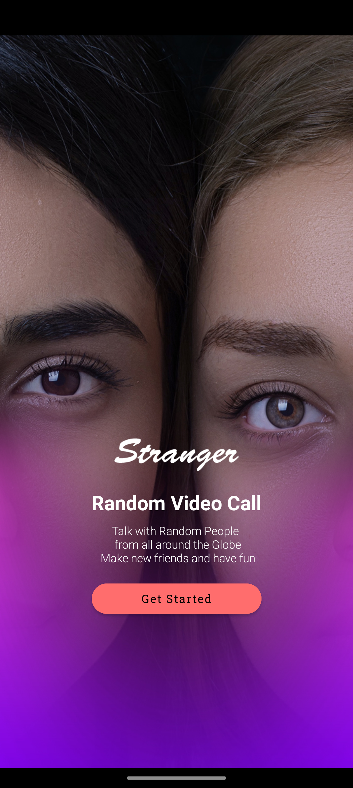
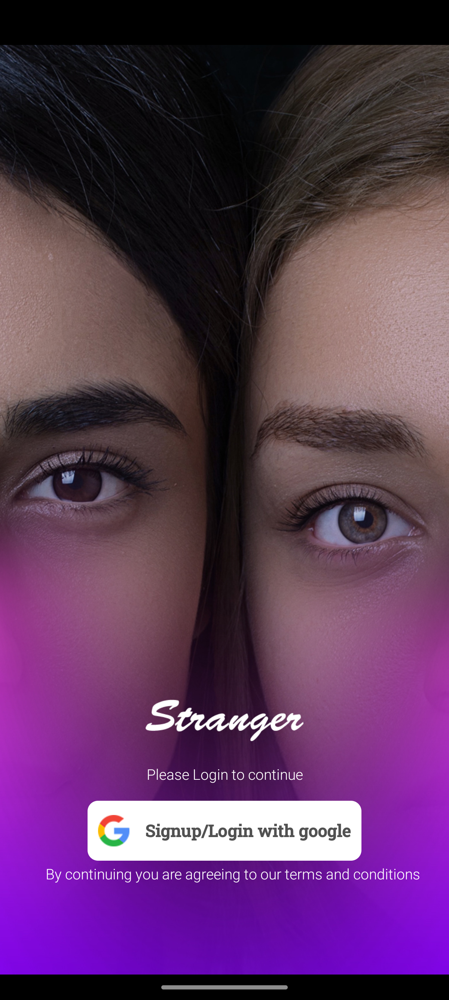
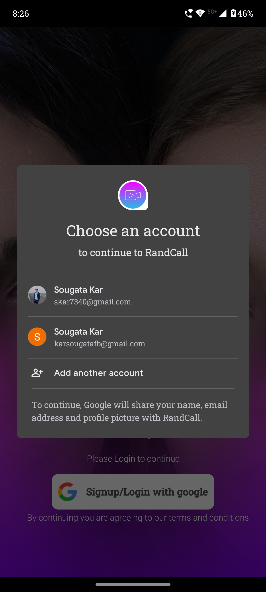
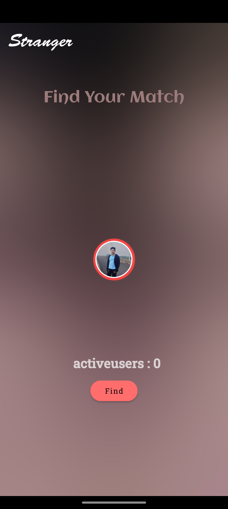
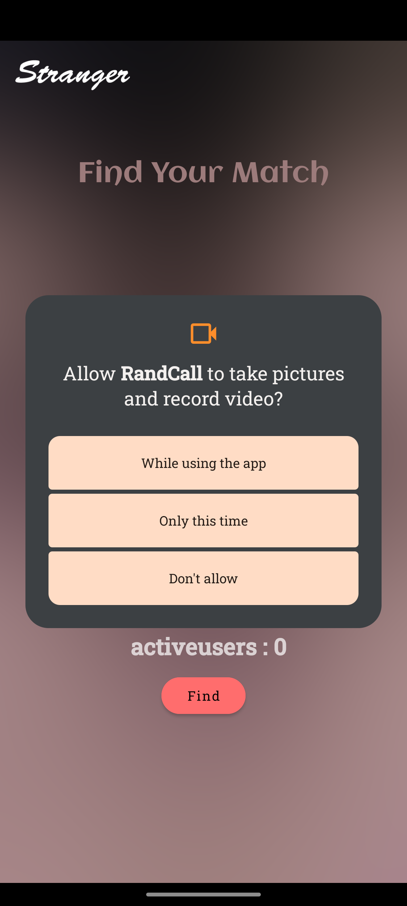
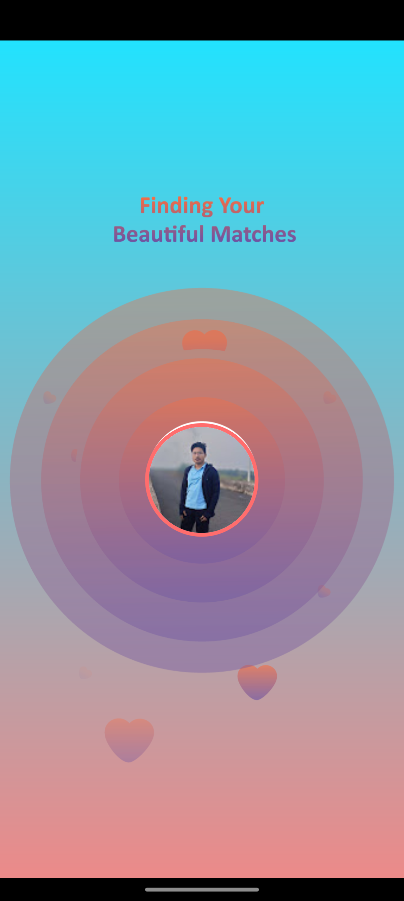
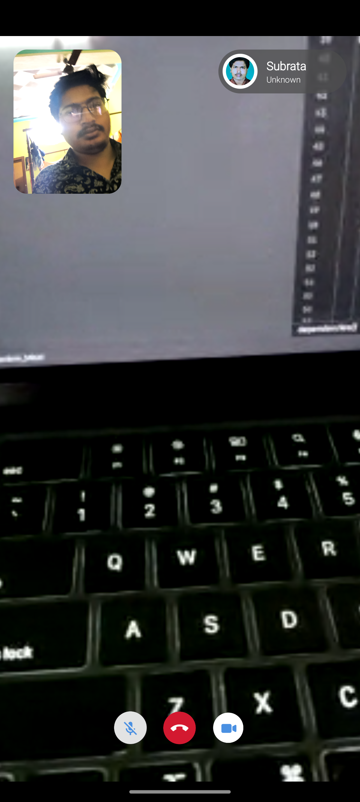

# RandCall - Random Video Calling App

RandCall is a random video calling app that connects users globally using **WebRTC** and **PeerJS**. It features **Google Sign-In via Firebase**, a simple and intuitive UI, and essential call controls.

## Features
- **Google Login** via Firebase Authentication
- **Random Video Calls** using WebRTC and PeerJS
- **Permissions Handling** for Camera & Microphone
- **Call Controls**: Mute, Toggle Camera, and End Call
- **User-Friendly UI** with a seamless connection experience

---

## Screenshots & Video Walkthrough

### 1. **Intro Screen**
When the app starts, users are greeted with an **Intro Screen** containing a "Get Started" button.



---

### 2. **Google Sign-In**
Users sign in using their Google account.




---

### 3. **Home Screen**
Users can find a match by clicking the **Find Button**.



---

### 4. **Permission Request**
Before joining a call, users must grant **Camera and Microphone** permissions.



---

### 5. **Finding Screen**
Once permissions are granted, users enter the **Finding Screen**, waiting to match with another user.



---

### 6. **Video Call Screen**
When another user is found, the **video call starts**.



---

### 7. **Call Controls**
Users can **Mute**, **Toggle Camera**, or **End Call** using the call controls.


---

## 📹 Video Demonstration
Watch a full walkthrough of **RandCall** in action:  
[](images/randcall_demo.mp4)

---

## Installation & Setup

1. Clone the repository:
    ```bash
    git clone https://github.com/Sougata1st/Random_Meet.git
    ```

2. Open the project in **Android Studio**.

3. Install the necessary dependencies using Gradle.

4. Set up Firebase:
   - Go to the [Firebase Console](https://console.firebase.google.com/) and create a new project.
   - Add an Android app to the project using your app's package name.
   - Download the **google-services.json** file and place it in your app's `app` directory (`app/google-services.json`).
   - Enable **Google Sign-In** in Firebase Authentication.
   - Add the Firebase SDK by ensuring your `build.gradle` files are configured correctly:

     **Project-level `build.gradle`**:
     ```gradle
     dependencies {
         classpath 'com.google.gms:google-services:4.4.1' // Check for latest version
     }
     ```

     **App-level `build.gradle`**:
     ```gradle
     plugins {
         id 'com.android.application'
         id 'com.google.gms.google-services'
     }
     ```

5. Run the project:
    ```bash
    ./gradlew clean build
    ./gradlew installDebug
    ```
   Or directly from **Android Studio** by clicking **Run** ▶️.

---

## Tech Stack

- **Frontend**: XML (Android)
- **Backend**: Firebase (for authentication)
- **Video Call**: WebRTC, PeerJS
- **State Management**: Kotlin

---

## Contributing
Feel free to contribute by opening issues or pull requests.

---

## License
This project is licensed under the **MIT License**.
